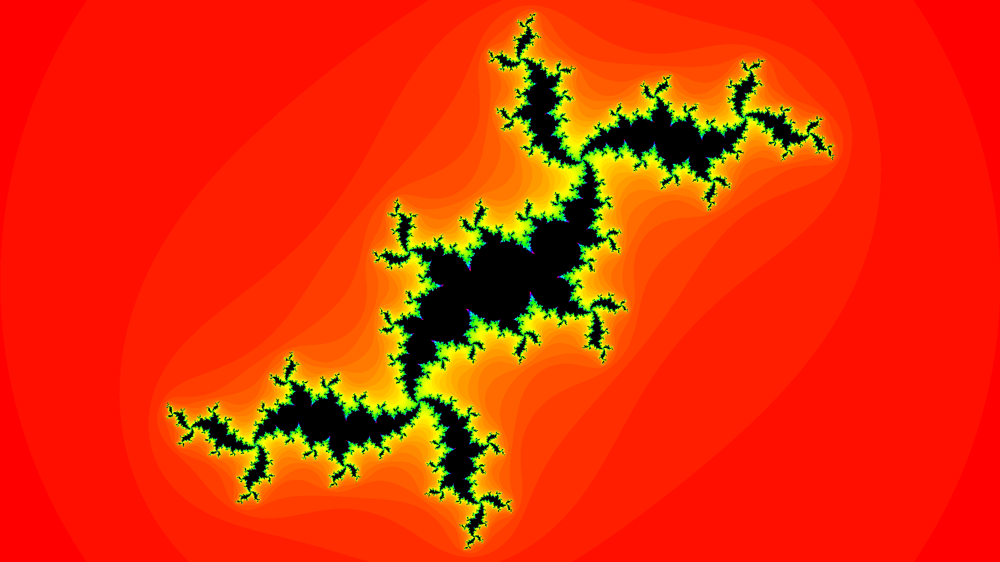

# Animated-Julia
Animated Julia set written in Rust

](https://www.youtube.com/watch?v=GRp3HAUCKk8)
## Usage

```
Usage: julia [MODE]
Modes:
    "-jd <re(c)> <im(c)>": Display a simple Julia fractal
    "-jr <norm(c)>": Render a Julia rotation GIF
    "-md": Display the Mandelbrot fractal
    "-mz <re(c)> <im(c)>": Zoom on the Mandelbrot fractal
```
This program will output every frame into `./render`.  
You'll need `ffmpeg` to turn this into a GIF/Video.

## Build
Clone the git and just `cargo build --release`
